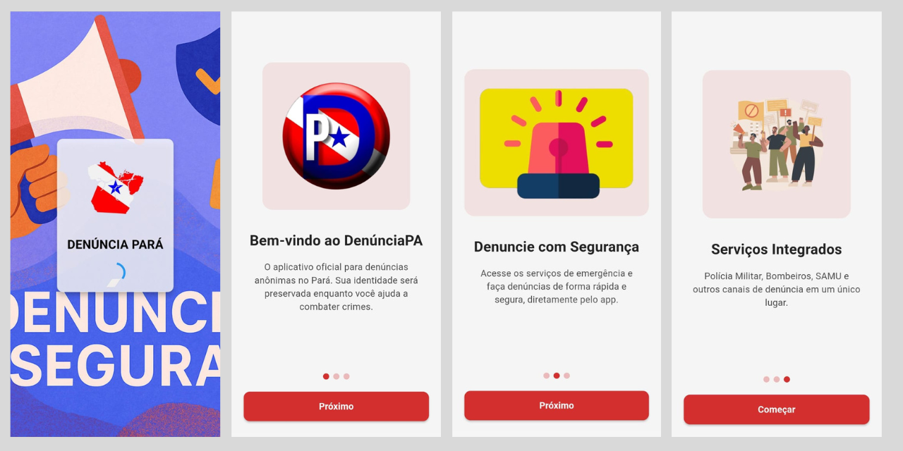
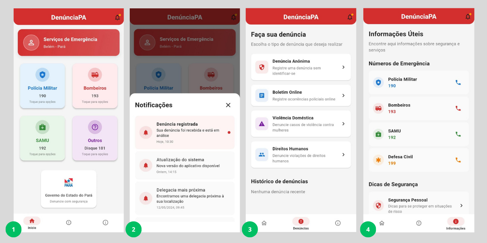

# 📱 Denúncia Pará – Segurança e Emergência


Em momentos de emergência, cada segundo pode fazer a diferença entre salvar uma vida ou não. Pensando nisso, desenvolvemos o **Denúncia Pará**, um aplicativo simples e direto que reúne os principais serviços de emergência do estado em um único lugar. Nele, é possível acionar rapidamente a Polícia Militar, o Corpo de Bombeiros, o SAMU, além de órgãos como o Detran, Ibama, Defesa Civil, entre outros.

---

### 👨‍💻Desenvolvedores

- [Davi Serrão Lima (responsável pela documentação)](https://github.com/D4vi2205)
- [Rafael Góes Duarte](https://github.com/rafaelgoesti)
- [Marcus Paulo da Silva Batista](https://github.com/marcusbatistadev)
- [Luan Levi Barbosa de Carvalho](https://github.com/Luan-carvalho-b)
---

### 🛠️ Tecnologias Utilizadas

-  **Flutter** – Framework para desenvolvimento multiplataforma mobile  
-  **Dart** – Linguagem de programação usada no Flutter  
-  **Visual Studio Code / Android Studio** – IDEs utilizadas no desenvolvimento  
-  **Material Design** – Guia de estilo para interface do usuário  
-  **Git** – Controle de versão  
## 🎯 Objetivo do Aplicativo

Nosso principal objetivo com este aplicativo é facilitar o acesso da população a serviços de emergência e canais de denúncia, tudo de forma prática, acessível e segura.

Durante situações críticas — como acidentes, ocorrências policiais, ou emergências médicas — muitas pessoas não sabem qual número ligar ou acabam se confundindo na hora. Além disso, em momentos de estresse, é comum entrar em pânico e não conseguir pensar com clareza. 

Com isso em mente, o Denúncia Pará reúne em uma única plataforma os principais serviços de emergência, permitindo ao usuário acionar rapidamente o socorro necessário ou registrar uma denúncia anônima com apenas alguns toques na tela.

O app também foi pensado para ser acessível a diferentes perfis de usuários, com uma interface simples e direta. Isso ajuda a garantir que qualquer pessoa — mesmo em situações de tensão — consiga navegar com facilidade e buscar ajuda rapidamente.

Mais do que um app funcional, queremos que ele seja uma ferramenta que contribua para a segurança e bem-estar da população.

---

## ⚙️ Funcionalidades


O Denúncia Pará oferece diferentes serviços, organizados por órgão responsável. Cada um deles conta com ferramentas específicas para facilitar o contato e o registro de ocorrências:

## 🚨 Serviços de Emergência Disponíveis no App

### 👮 Polícia Militar

- **Formulário de denúncia**: Envie relatos de forma segura e discreta.  
- **Ligação direta**: Chamada imediata para o **190**.  
- **Boletim de ocorrência online**: Acesso direto ao site oficial.  
- **Mapa de delegacias próximas**: Visualize as unidades mais próximas de acordo com sua localização.  
- **Área de dúvidas**: Tire dúvidas sobre os serviços oferecidos pela PM.

---

### 🚑 SAMU

- **Ligação direta**: Chamada para emergências médicas.  
- **Formulário de emergência**: Relate situações que necessitam de atendimento de saúde.  
- **Dúvidas frequentes**: Informações úteis sobre o funcionamento do SAMU.

---

### 🚒 Corpo de Bombeiros

- **Ligação direta**: Contato com os bombeiros para casos de incêndios, acidentes e resgates.  
- **Formulário de emergência**: Relato detalhado da ocorrência.  
- **Área de dúvidas**: Informações e perguntas comuns sobre o serviço.

---

### 🏛️ Outros Órgãos

Além dos serviços estaduais, o app também conecta o usuário a outras instituições de segurança e fiscalização:

- Polícia Federal, Polícia Rodoviária Federal, IBAMA, Defesa Civil, DETRAN e ANVISA são alguns dos órgãos disponíveis. Para todos eles, há opções de **Formulário de relato** e **Ligação direta**.


---

## 🖥 Interface e Navegação

A interface do **Denúncia Pará** foi pensada para ser clara, direta e funcional, especialmente considerando que será usada em momentos de urgência.

### 🏠 Tela Inicial

Logo na primeira tela, o usuário encontra cartões com os principais serviços organizados por cores e ícones. Cada um leva a uma nova tela com as opções disponíveis para aquele órgão.

As categorias principais são:

- 👮 Polícia Militar  
- 🚒 Corpo de Bombeiros  
- 🚑 SAMU  
- 🏛️ Outros Órgãos

Além disso:

- 📍 A **localização do usuário** é exibida no topo (por exemplo, *Belém - PA*)  
- 🏢 A **identidade visual do Governo do Estado** aparece no rodapé, reforçando a legitimidade do app

### 📲 Navegação Interna

Ao entrar em qualquer uma das categorias, o usuário encontra menus com as opções de denúncia, ligação, informações e dúvidas.  
Tudo é padronizado, para que a pessoa **não precise reaprender a usar o app** a cada nova seção.

A navegação é feita por uma **barra inferior** com ícones para:

- 🏠 Início  
- 📋 Ocorrências  
- ℹ️ Informações

---

## 🎨 Decisões de Design

Cada serviço tem uma **cor e um ícone próprios** para facilitar a identificação rápida. A interface é **limpa e organizada em blocos**, o que melhora a legibilidade. Tudo foi pensado para funcionar bem em **diferentes tamanhos de tela** e **níveis de habilidade com tecnologia**. 🗣️ Os textos são **objetivos** e os botões **bem posicionados**.
> Nosso foco foi criar uma experiência **simples, mas eficiente** — especialmente em situações onde **tempo e clareza são essenciais**.

## 📂 Estrutura do Projeto

```plaintext
lib/
├── main.dart
├── screens/
│   ├── home_screen.dart
│   ├── denuncia_form.dart
│   ├── detalhes_servico.dart
│   ├── ocorrencias_screen.dart
│   ├── boletim_online_page.dart
│   ├── bombeiro_emergencia_page.dart
│   ├── delegacias_anonime_page.dart
│   ├── denuncia_anonime_page.dart
│   ├── intro_screen.dart
│   ├── onboarding_screen.dart
│   └── splash_screen.dart
├── widgets/
├── services/
├── models/
│   └── denuncia.dart
└── utils/
```

## 🚀 Como Executar o Projeto

### 1️⃣. Clone o repositório
```bash
git clone https://github.com/app-denuncia-para/denuncia-pa.git
cd app-denuncia-para
```

## 2️⃣ Instale as dependências
```bash
flutter pub get
```
## 3️⃣ Verifique se o dispositivo está conectado
```bash
flutter devices
```
## 4️⃣ Execute o aplicativo
```bash
flutter run
```

## 🧪 Testes

### 🔹 Testes Manuais
Você pode testar manualmente as funcionalidades principais do app:

1. Abrir o app com `flutter run`.
2. Navegar pelas seções (Polícia Militar, SAMU, Bombeiros, etc.).
3. Testar botões de ligação, envio de formulário e acesso a links.
4. Verificar se a localização é exibida corretamente na tela inicial.
5. Garantir que o design está responsivo em diferentes tamanhos de tela.

## 📱 Documentação do Aplicativo DenúnciaPA

### 🛠️ Principais Componentes

### ⚙️ `MyApp` (Classe Principal)
- **Função**: Configuração inicial do aplicativo
- **Métodos**:
  - `build()`: Define o tema global e configurações do MaterialApp
    - Configura cores, tipografia, cards e botões
    - Define `SplashScreen` como tela inicial

### 🏠 `HomePage` (Tela Principal)
- **Estado**: `_HomePageState` gerencia a navegação e conteúdo
- **Variáveis Importantes**:
  - `_selectedIndex`: Controla a aba selecionada (0=Início, 1=Denúncias, 2=Informações)
  - Listas de opções: `_policeOptions`, `_firefighterOptions`, `_samuOptions`, `_otherReports`

#### 🔄 Métodos Principais:

##### 🧭 Navegação
- `_onItemTapped(int index)`: Alterna entre as abas principais

##### 🎨 Componentes de Interface
- `_buildBottomNavBar()`: Cria a barra de navegação inferior
- `_buildServiceCard()`: Constrói cards de serviços na tela inicial
- `_buildReportTypeCard()`: Cria cards para tipos de denúncia

##### 🗨️ Modais e Diálogos
- `_showNotificationsModal()`: Exibe notificações em modal
- `_showOptionsModal()`: Mostra opções de serviço em modal
- `_showOtherReports()`: Exibe outros canais de denúncia
- `_showFaq()`: Mostra diálogo com dúvidas frequentes

##### ⚡ Funcionalidades
- `_callNumber(String number)`: Realiza chamadas telefônicas
- `_handleOptionSelection()`: Gerencia ações das opções selecionadas

##### 📂 Conteúdo das Abas
- `_buildReportsContent()`: Constrói a aba de Denúncias
- `_buildInfoContent()`: Constrói a aba de Informações

### 📄 Páginas Especializadas
- **DenunciaAnonimaPage**: Formulário para denúncias anônimas
- **BoletimOnlinePage**: Registro de ocorrências policiais online
- **DelegaciasProximasPage**: Localização de delegacias próximas
- **BombeiroEmergenciaPage**: Serviços de emergência dos bombeiros

## 🔄 Fluxos Principais

### 1️⃣ Fluxo de Denúncia
1. Usuário seleciona "Denúncia Anônima"
2. Navega para `DenunciaAnonimaPage`
3. Preenche formulário e envia denúncia

### 2️⃣ Fluxo de Emergência
1. Usuário toca em card de serviço (ex: Bombeiros)
2. Modal com opções é exibido (`_showOptionsModal`)
3. Seleção de "Emergência" navega para `BombeiroEmergenciaPage`

### 3️⃣ Fluxo de Informações
1. Usuário acessa aba "Informações"
2. Visualiza números de emergência e dicas de segurança
3. Pode ligar diretamente para serviços

## 💎 Recursos Importantes

### 🎨 Temas e Estilo
- Esquema de cores baseado em vermelho (`#D32F2F`)
- Tipografia Roboto
- Cards com bordas arredondadas (16px)
- Design responsivo para diferentes tamanhos de tela

### 🔗 Integrações
- `url_launcher`: Para realizar chamadas telefônicas
- Números de emergência pré-configurados (190, 192, 193, etc.)

### ♻️ Componentes Reutilizáveis
- Cards de serviço padronizados
- Modais com layout consistente
- Itens de lista com ícones e cores temáticas

## 📄 Licença
Este projeto está licenciado sob a [MIT License](LICENSE).